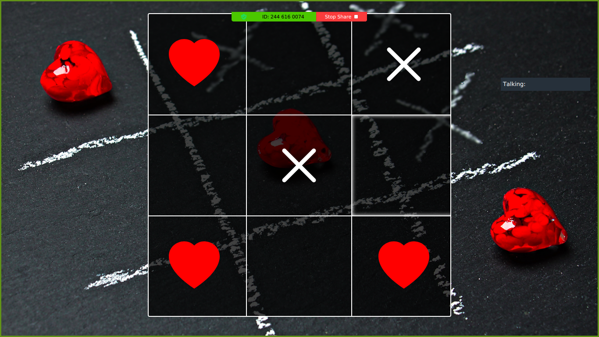

# Javascript Tic-Tac-Toe

> This is part of the Tic-Tac-Toe Project in [The Odin Project's](https://www.theodinproject.com/courses/javascript/lessons/tic-tac-toe-javascript?ref=lnav) Javascript Curriculum.

> The first player, who shall be designated a heart sign, has 3 possible strategically distinct positions to mark during the first turn, This applies also to the second player that also has a cross sign. Each player takes turn to play until It has the same sign Vertically or diagonally or horizontally.Then there is a winner OR a draw.

 View the app live [here](https://taiwocoker.github.io/JavaScript_Tic-Tac-Toe/)
 
## Built With

- Javascript, HTML and CSS
- VSCode, Linters

## Getting Started

To get a local copy up and running follow these simple example steps.

- Clone the repository and there you go! ;-)

### Prerequisites

- Get a browser like Chrome and Firefox in their most recent versions

### Setup

- Clone the repository on your local machine
- cd into the folder

### Install

- Install VSCode or any code editor you like

## Authors

👤 **Manezeu Patricia Chrystelle**

- Github: [@githubhandle](https://github.com/patriciachrysy)
- Twitter: [@twitterhandle](https://twitter.com/ManezeuP)
- Linkedin: [linkedin](https://www.linkedin.com/in/manezeu-patricia-chrystelle-095072118/)

👤 **Taiwo Coker**

- Github: [@githubhandle](https://github.com/taiwocoker)
- Twitter: [@twitterhandle](https://twitter.com/SelloCoker)
- Linkedin: [linkedin](https://linkedin.com/in/taiwo-coker)

## 🤝 Contributing

Contributions, issues and feature requests are welcome!

Feel free to check the [issues page](https://github.com/taiwocoker/JavaScript_Tic-Tac-Toe/issues).

## Show your support

Give a ⭐️ if you like this project!

